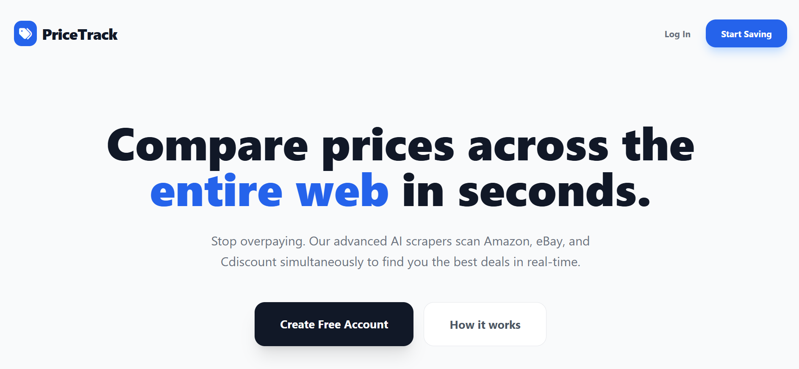
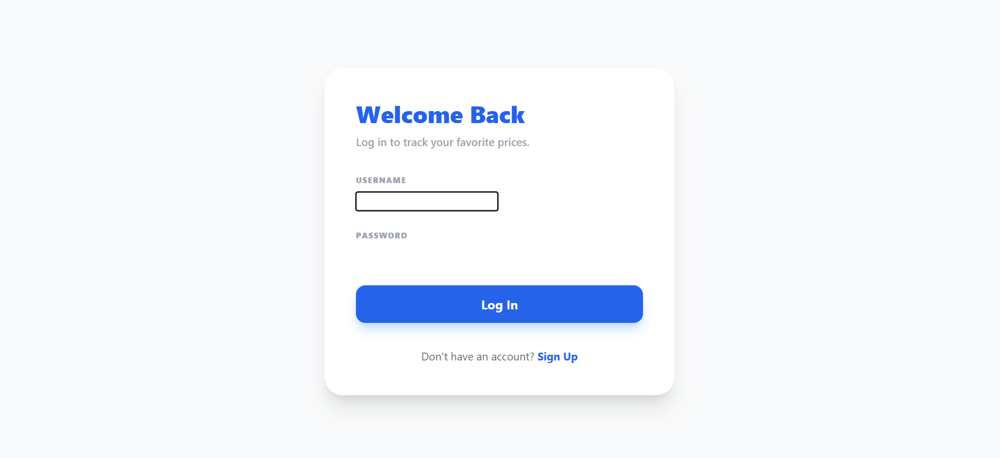
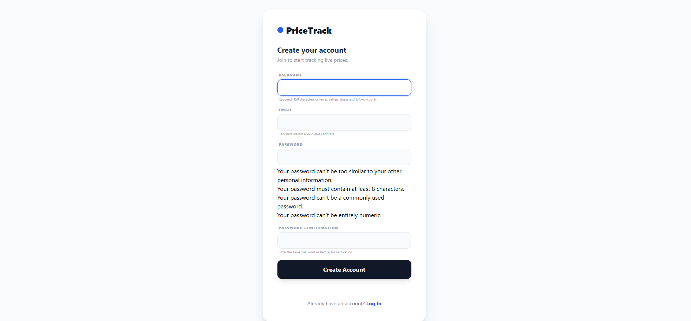
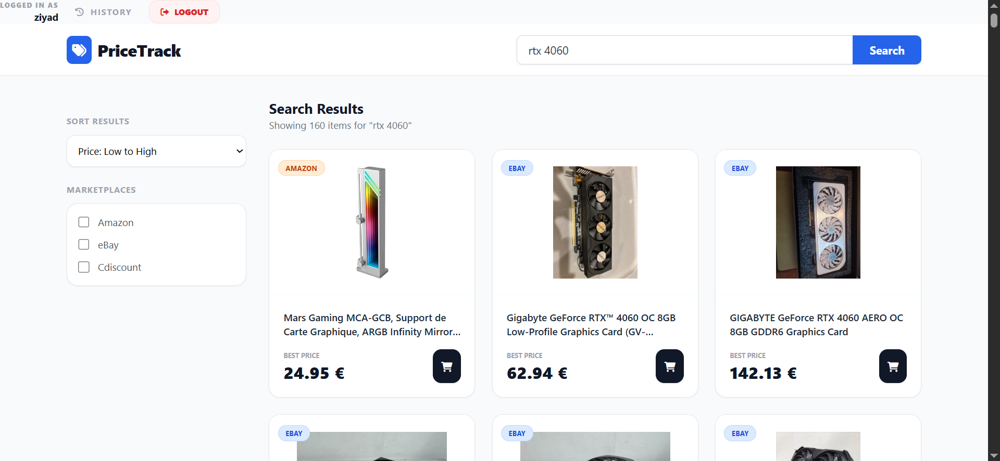
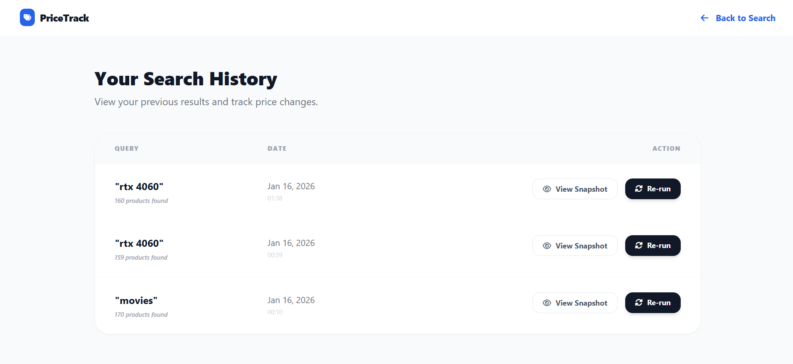
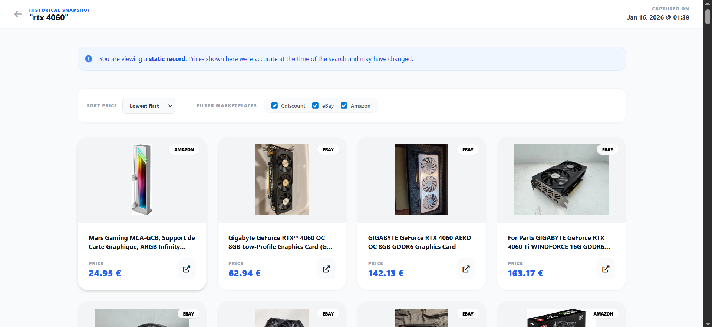

# 🚀 PriceTrack: High-Concurrency Price Aggregator

**PriceTrack** is a web scraping suite built with **Django** and **Playwright**. It allows users to compare live market prices across major e-commerce platforms (Amazon, eBay, Cdiscount) simultaneously, featuring a persistent history system with historical data "snapshots."

---

## 🛠️ Technical Skill Showcase

This project demonstrates advanced full-stack engineering principles, specifically addressing the challenges of high-latency web automation within a synchronous web framework.

### 1. Asynchronous Concurrency & Performance

- **Parallel Execution:** Instead of sequential scraping, I implemented `asyncio.gather` to trigger multiple Chromium instances at once. This reduces total search time from ~45 seconds to under 15 seconds.
- **Django-Async Bridge:** Engineered a thread-safe bridge using `asgiref.sync` and `sync_to_async` to allow Django’s synchronous middleware (Auth/Sessions) to interact with the asynchronous scraping engine.
- **Windows Loop Optimization:** Solved the common `ProactorEventLoop` conflict on Windows systems by implementing a custom `threaded_wrapper` for the Playwright event loop.

### 2. Intelligent Data Management

- **JSONB Snapshotting:** Utilized Django’s `JSONField` to store raw scraping results. This provides "Historical Snapshots," allowing users to view past market states instantly without re-triggering expensive network requests.
- **Session Caching:** Implemented a caching layer to store results during a session, enabling near-instant client-side filtering and sorting without redundant database hits or re-scraping.

### 3. Fullstack Development

- **Advanced Python:** Implementation of object-oriented scraper classes, asynchronous programming (asyncio), and complex data cleaning using RegEx and list comprehensions.

- **Django:** Management of the full MVT (Model-View-Template) architecture, including custom authentication flows, JSONField database integration, and session-based state management.

- **Tailwind CSS & HTML:** Developed a responsive, modern UI with a focus on UX/UI principles, featuring custom-designed product cards, dynamic loading states, and ergonomic layouts.

---

## 🏗️ Project Architecture

- **Authentication (Sync):** A clean, standard Django auth flow (Register/Login) with mandatory email verification logic.
- **Search Engine (Async):** A Playwright-powered engine that handles dynamic content, React hydration (on Cdiscount), and complex DOM selectors.
- **History System:** A dashboard for users to view their previous search results or rerun previous searches.

---

## 🧭 Website Navigation & Core Functionalities

PriceTrack is organized into five primary views, each serving a specific role in the data aggregation lifecycle.

### 1. Landing Page (`/`)

The entry point of the application. It features a clean, high-conversion hero section that explains the platform's value proposition. It serves as the gateway for new users to register and existing users to access their dashboard.


### 2. Authentication Suite (`/login` & `/register`)

Secure, customized entry points for user access.

- **Functionality:** Handles unique email registration, password hashing, and session creation.
- **Technical Detail:** Uses Django’s built-in auth system extended with custom Tailwind-styled forms and validation logic to ensure data integrity from the first click.
  
  

### 3. Search Dashboard (`/search`)

The "Engine Room" of the project.

- **Functionality:** A centralized search bar where users input queries and select target marketplaces.
- **The "Live" Experience:** Triggers the parallel Playwright scrapers. Results are rendered in a responsive grid with real-time price sorting and site-specific filtering.
- **State Management:** Uses Django sessions to cache results, allowing for instant UI updates without re-scraping the web.
  

### 4. Search History (`/history`)

A personalized administrative dashboard for every user.

- **Functionality:** Displays a chronological list of all previous searches, including the date, number of items found, and the specific sites queried.
- **Action Center:** Users can choose to **Re-run** a search (to get live current prices) or **View Snapshot** (to see past data).
  

### 5. Historical Snapshot View (`/history/snapshot/<id>/`)

The platform’s "Time Machine" feature.

- **Functionality:** Renders a static version of a previous search exactly as it appeared when first performed.
- **Technical Detail:** It pulls from the `JSONField` in the database, meaning it loads in milliseconds. Users can still apply filters and sorting to this historical data to find the best deal that existed at that specific moment in time.
  

---

## 🚦 Getting Started

### Prerequisites

- Python 3.13+
- Pip (Python Package Manager)

### Installation & Setup

1. **Clone the Repository**

```bash
git clone https://github.com/yourusername/PriceTrack.git
cd PriceTrack

```

2. **Install Precise Dependencies**

```bash
pip install -r requirements.txt

```

3. **Initialize Playwright Browsers**

```bash
playwright install chromium

```

4. **Database Migration & Admin Setup**

```bash
python manage.py migrate
python manage.py createsuperuser

```

5. **Run Server**

```bash
python manage.py runserver

```

---

## 📈 Usefulness & Impact

In a fragmented e-commerce market, **PriceTrack** serves as a vital tool for:

- **Market Research:** Tracking how competitors price items over weeks using the snapshot feature.
- **Consumer Savings:** Instantly finding the lowest price without opening 10 browser tabs.
- **Developer Reference:** A clean boilerplate for integrating Playwright with Django in an asynchronous environment.

---

## ⚖️ Ethical Considerations

This suite is designed for **academic research and educational purposes**. It strictly adheres to:

- **Rate-limiting** to respect target server resources.
- **Public Data Access** only (no scraping of private or authenticated user data).

---

## 📊 Beyond the UI: Data Acquisition for Advanced Engineering

The scraper engine in this project is designed as a **modular data acquisition layer**. Because it outputs structured, cleaned, and validated JSON/CSV data, it can be decoupled from the Django frontend and integrated into various high-level engineering workflows:

### 1. Machine Learning & Price Prediction

The historical snapshots collected by this tool provide a ready-to-use dataset for **Time-Series Forecasting**.

- **Model Training:** Use the `SearchHistory` data to train regression models (like XGBoost or LSTM) to predict future price fluctuations based on historical trends.
- **Sentiment Correlation:** Combine this data with social media scraping to analyze how public sentiment affects marketplace pricing.

### 2. Operations Research: "Optimal Buy-Wait" Strategies

By treating product purchasing as an **Optimization Problem**, the data gathered can be fed into algorithms to determine the best time to buy.

- **Dynamic Programming:** Implement an "Optimal Stopping" algorithm (like the Secretary Problem) to decide whether to purchase at the current price or wait for a predicted lower price.
- **GPU Allocation Logic:** For engineering tasks (like my previous work on GPU deployment), this engine can be used to track the real-time cost-per-Teraflop across different vendors to optimize hardware procurement budgets.

### 3. Competitor Intelligence & Arbitrage

The multi-source nature of the engine makes it a perfect tool for identifying **Market Inefficiencies**.

- **Price Arbitrage:** Automatically identify items that are significantly cheaper on one platform (e.g., eBay) compared to others (e.g., Amazon) for resale opportunities.
- **Inventory Tracking:** By monitoring the frequency of "Out of Stock" labels across snapshots, one can model the supply chain health of specific product categories.

### 4. Headless API Integration

The `threaded_wrapper` and scraper classes can be imported into:

- **Discord/Telegram Bots:** To provide instant price alerts to user groups.
- **CLI Tools:** For engineers who want to query market data directly from the terminal during development.

You can find the scrapers in the App/utils.py file or in my E-commerce-Data-Extraction-Intelligence-Suite Github Repository at:
https://github.com/ziyadouarrad-etu/E-commerce-Data-Extraction-Intelligence-Suite

---

**Developed by Ouarrad Ziyad — AI & Computer Science Engineering Student at ENSAM Casablanca.**
